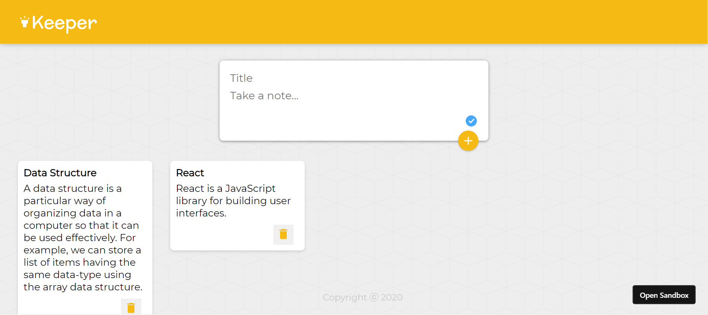

# Keeper

Keeper App is used to save your notes for future reference. Developed using ReactJS and CodeSandbox.

Screenshot of Keeper App 

🏃‍♂️ Local Installation

Drop a ⭐ on the Github Repository.

Clone the Repo by going to your local Git Client and pushing in the command: https://github.com/kishanmanitiwari/Keeper

Install the Node Modules: npm install

At last, push in the command which will kickstart the application on Local Host: npm start
